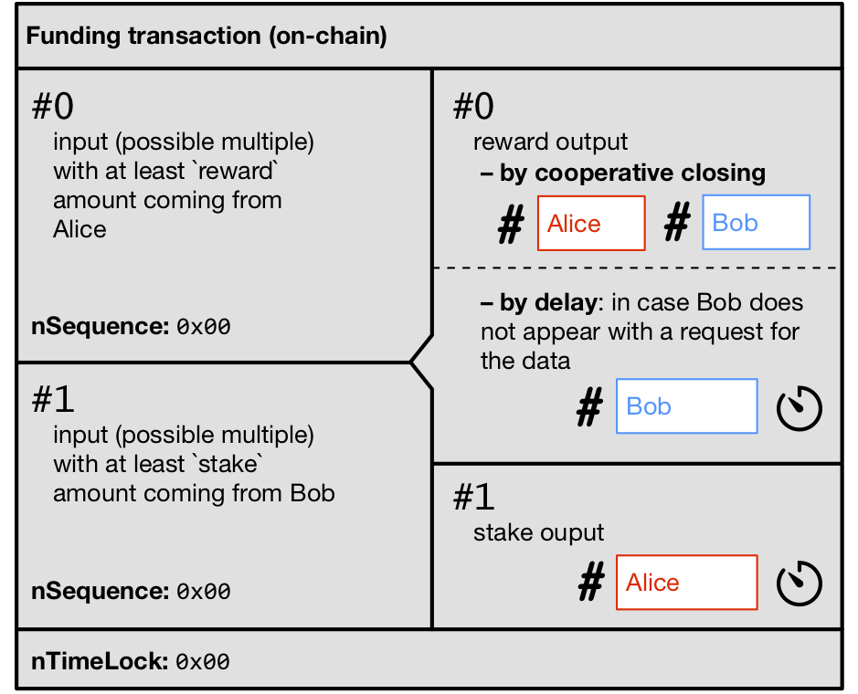
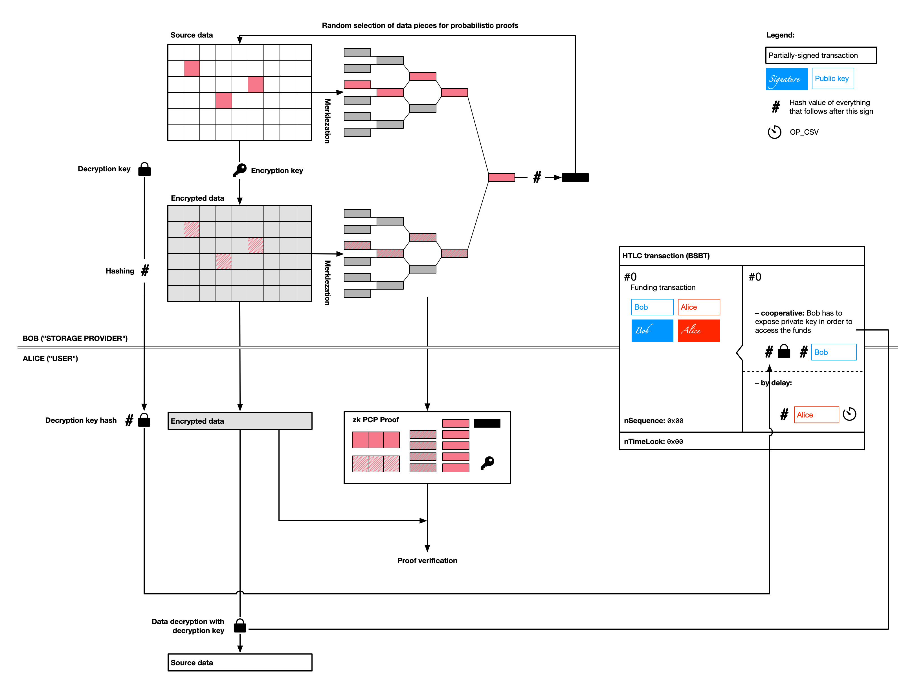

# Storm

Storm is a L2/L3 distributed storage and messaging with economic incentivisation leveraging LNP/BP ecosystem. 

* [Protocol overview](#protocol-overview)
* [Probabilistic checkable proofs](#probabilistic-checkable-proofs)
* [Storm with Lightning](#storm-with-lightning)
* [Messaging support](#messaging-support)
* [Further possible enhancements](#further-possible-enhancements)
* [Contributors](#contributors)

## Protocol overview

Let's start with a simple storage case – and later we will elaborate on how it can be extended to 
[messaging](#messaging-support) and [more complex storage scenarios](#further-possible-enhancements).

In our initial setting, Alice wants to store some data remotely and prepared to pay for that some `reward` in bitcoins.
Bob, on the other hand, is willing to store the data for Alice and be paid a `reward`. Alice and Bob can agree on the
storage conditions, however they face some counterparty risks, namely:
1. If Alice due to some reason would not need the data anymore, Bob may not get paid
2. If Bob provides data back to Alice on her request, Alice have no obligations to pay to Bob
3. If Alice decides that the cost of storage exceeds the `reward` later (when the agreement is set), she may delete the
   data and Bob will be unable to receive them back even if he is still willing to pay.

All these risks can be mitigated with a specially designed **storm payment channel**, created with a published **funding
transaction** followed by partially-signed unpublished transactions containing special forms of Bitcoin script-based
smart contracts described below. Moreover, this *storm payment channel* may be created on top of existing Lightning 
Network channel with addition of special outputs to the **LN commitment transaction** (which will require modification
of some of existing BOLTs) – see [Storm with Lightning](#storm-with-lightning) section for the details.

The proposed protocol utilises the following technologies:
* Probabilistic checkable proofs [see collection of papers here](https://github.com/dr-orlovsky/library/tree/master/privacy%20%26%20zk/computational%20integrity)
* Concept of payment channels
* Partially-signed and unpublished bitcoin transactions
* CVS-locked transactions
* HTLC contracts
* Data encryption with asymmetric key pairs

The first counterparty risk (of Alice loosing reward in case when Bob does not needs CSV data anymore and avoids payment)
is mitigated by Bob depositing `reward` to a special *funding transaction* containing CSV-output to Alice public key.
This output must be in a distant future, much beyond the time when Bob needs to receive the data, and must contain 
`reward/factor`, in order to ensure that Alice will provide the data to Bob on his request.

The second counterparty risk (of Bob not paying Alice for the data provided) is mitigated by creation of a special 
**HTLC transaction**, pre-signed by Bob, allocating full `reward` to Alice when she will expose the decryption key –
after Alice provided Bob with an encrypted copy of the data and a hash of the decryption key. To make sure that Alice
did decrypt the correct data, it also provides Bob with a specially-constructed 
[probabilistic checkable proof](#probabilistic-checkable-proofs).

The third counterparty risk (of Alice discarding Bob's data if she is not interested in the `reward` anymore) is 
mitigated by Alice depositing a `stake >> reward` into the *funding transaction*, which will be paid back to Alice only 
if the *HTLC transaction* will be published onchain; otherwise these funds will go to Bob under CSV condition.

Scenario        | Alice payment  | Bob payment
--------------- | -------------- | -----------
Cooperative     | `reward+stake` | `0`
Bob's timeout   | `reward+stake` | `0`
Alice's timeout | `reward`       | `stake`

Thus, the *funding transaction* should be constructed in the following way:

The simple sequence of these actions looks in the following way:

The data workflow is organized in the following way:

## Probabilistic checkable proofs

Probabilistic checkable proofs allows to verify in a non-interactive way computational integrity for some process
(like data encoding in our case) without exposing the source data used for computation (i.e. providing zero-knowledge
argument). 

Briefly, if Alice wants to provide Bob with some non-interactive argument that the encrypted data (available to Bob)
are really correspond to some un-encrypted pre-image (which is unknown to Bob), she needs to undertake the following:
1. Split the source data into chunks of the same size (like 256 bytes or 1kb)
2. Encrypt those data chunk by chunk with some encryption key
3. Compute Merkle trees from hashes of the chunks in unencrypted source data and encrypted data
4. Combine two Merkle tree roots into a single one and get SHD256 hash of it. This hash will work as a random oracle for
   further process
5. Use this random number to select 1-10% of the data chunks
6. Provide Bob with
   * encryption key
   * selected data chunks (for both encrypted and unencrypted data)
   * Merkle tree paths to the selected chunks
   * hash of the combined Merkle tree roots
   
With this data Bob will be able to check with this zero-knowledge argument by:
1. Checking Merkle tree paths leading to the chunks and resulting Merkle tree root hash to correspond to them
2. Checking that the selected source data chunks when encrypted with the proviede encryption key are byte-to-byte 
   equal to their encrypted version provided by Alice.

If Alice wants to falsify the proof (because, for instance, she keeps only some part of the data), she needs to "mine" 
encryption and decryption key pairs in such a way that the data encrypted with them will result in a such Merkle tree 
root hash will allow to select only those blocks which are kept by her. Since encryption process is expensive, and it 
also requires multiple hashes to be computed, it's quite easier to make the cost of such brute-force attack by Alice to 
be significantly higher then the actual `reward+stake`, i.e. render it economically irrational.

## Storm with Lightning

The proposed **funding transaction**, keeping both `reward` from Bob and `stake` from Alice in case of Lightning channel
between Alice and Bob will be represended by a funds coming from both parties allocated into an additional output within
the **commitment transaction**, which can be spend in the exactly the same manner either via timeouts or HTLC-based
settlement. Once HTLC-based settlement is achieved, this output can be discarded and the **commitment transaction** can
be updated with a new balances taking into account the `reward` paid to Alice by Bob.

## Messaging support

The same framework may be utilized for the case of messaging, when Bob is willing to pay for some message, which content
he does not know, to delivered to him by Alice, which holds such message (i.e. received on his behalf). This situation
is a good companion to the existing LN message routing incentivisation mechanics, covering the inverse case to the case
of Lightning Network routing.

## Further possible enhancements

The workflow can be extended to the case when Bob's makes regular requests to Alice in order to proof the fact that
Alice continues to keep the data to further insure data safety; in this case Alice will have to generate new encryption/
decription key pair each time and the HTLC transaction needs to be updated alike LN commitment transaction.

Also, the actual data may be split by Bob into multiple pieces, so not only Alice, but many other parties will be 
responsible for keeping the data (like in Bittorrent protocol) with some degree of redundancy.

## Contributors

The protocol was proposed by Dr Maxim Orlovsky from Pandora Core AG; the initial idea was discussed with
Giacomo Zucco @giacomozucco, Federico Tenga @fedsten, Marco Amadori @mammadori and @inbitcoin team and now opened to 
public comments.
