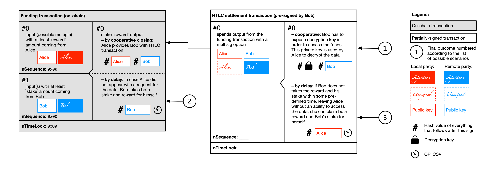
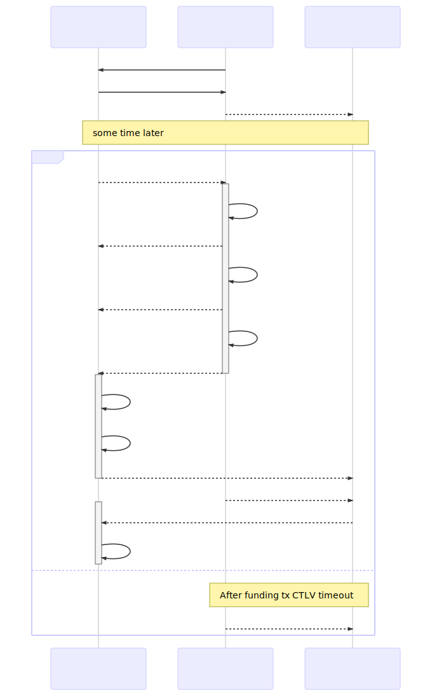
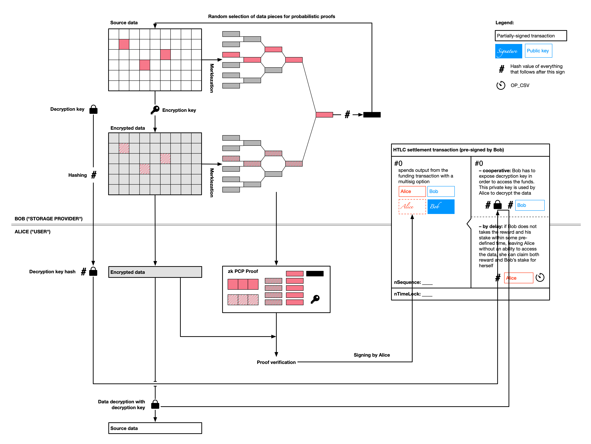

# Storm

Storm is a L2/L3 distributed storage and messaging with economic incentivisation leveraging LNP/BP ecosystem. 

* [Protocol overview](#protocol-overview)
* [Probabilistic checkable proofs](#probabilistic-checkable-proofs)
* [Storm with Lightning](#storm-with-lightning)
* [Messaging support](#messaging-support)
* [Further possible enhancements](#further-possible-enhancements)
* [Contributors](#contributors)

## Protocol overview

In order to understand the specification, you have to have a previous knowledge of the following technologies:
* Probabilistic checkable proofs [see collection of papers here](https://github.com/dr-orlovsky/library/tree/master/privacy%20%26%20zk/computational%20integrity)
* Concept of payment channels
* Partially-signed and unpublished bitcoin transactions
* CVS-locked transactions
* HTLC contracts
* Data encryption with asymmetric key pairs

Let's start with a simple storage case – and later we will elaborate on how it can be extended to 
[messaging](#messaging-support) and [more complex storage scenarios](#further-possible-enhancements).

In our initial setting, Alice wants to store some data remotely and prepared to pay for that some `reward` in bitcoins.
Bob, on the other hand, is willing to store the data for Alice and be paid a `reward`. Alice and Bob can agree on the
storage conditions, however they face some counterparty risks, namely:
1. If Alice due to some reason would not need the data anymore, Bob may not get paid
2. If Bob provides data back to Alice on her request, Alice have no obligations to pay to Bob
3. If Bob loses the data – or decides that the cost of storage exceeds the `reward` later (when the agreement is set), 
   he may delete the data and Alice will be unable to receive them back even if she is still willing to pay.

All these risks can be mitigated with a specially designed **storm payment channel**, created with a published **funding
transaction** followed by partially-signed unpublished transactions containing special forms of Bitcoin script-based
smart contracts described below. Moreover, this *storm payment channel* may be created on top of existing Lightning 
Network channel with addition of special outputs to the **LN commitment transaction** (which will require modification
of some of existing BOLTs) – see [Storm with Lightning](#storm-with-lightning) section for the details.

The first counterparty risk (of Bob loosing reward in case when Alice does not need CSV data anymore and avoids payment)
is mitigated by Alice depositing `reward` to a special *funding transaction* containing CSV-output to Bob's public key.
This output must be in a distant future, much beyond the time when Alice needs to receive the data, and must contain 
`reward`. In order to ensure that Bob will provide the data to Alice on her request Bob also co-signs an 
**HTLC settlement transaction** and provides it to Alice. This transaction spends the full amount of funds from the
**funding transaction** and, if signed by Alice and published (which signifies that Alice did not timeout), discards 
Bob's ability to retrieve the funds.

The second counterparty risk (of Alice not paying Bob for the data provided) is mitigated by the same
**HTLC settlement transaction**, pre-signed by Bob, allocating all of the deposited funds to Bob in case when he exposes
the decryption key. Alice signs this transaction only when she receives an encrypted copy of the data and a hash of the 
decryption key. To make sure that Bob did decrypt the correct data, it also provides Alice with a specially-constructed 
[probabilistic checkable proof](#probabilistic-checkable-proofs).

The third counterparty risk (of Bob discarding Alice's data if he is not interested in the `reward` anymore) is 
mitigated by Bob depositing a `stake` into the *funding transaction*, which will be paid back to Bob only 
if the *HTLC settlement transaction* cooperative conditions are fullfilled; otherwise these funds will go to Alice 
under CSV condition.

The transaction graph for the storm channel should be constructed in the following way:

These transactions covers the following scenarios:

Scenario                                      | Bob payment    | Alice payment
--------------------------------------------- | -------------- | -----------
Initial deposits for all scenarios            | `stake`        | `reward`
N1. Cooperative                               | `reward+stake` | `0`
N2. Alice did not requested the data from Bob | `reward+stake` | `0`
N3. Bob did not kept the data                 | `0`            | `stake+reward`
N4. Bob kept the data, but cooperation with Alice failed | `stake+reward*factor` | `reward*(1-factor)`
N5. Alice was provided with the data but not with the decryption key | `0`       | `stake+reward`

The simple sequence of the actions taken by Alice and Bob should look in the following way:

The data workflow between Alice and Bob is organized in the following way:

## Probabilistic checkable proofs

Probabilistic checkable proofs allows to verify in a non-interactive way computational integrity for some process
(like data encoding in our case) without exposing the source data used for computation (i.e. providing zero-knowledge
argument). 

Briefly, if Bob wants to provide Alice with some non-interactive argument that the encrypted data (available to Alice)
are really correspond to some un-encrypted pre-image (which is unknown to Bob), he needs to undertake the following:
1. Split the source data into chunks of the same size (like 256 bytes or 1kb)
2. Encrypt those data chunk by chunk with some encryption key
3. Compute Merkle trees from hashes of the chunks in unencrypted source data and encrypted data
4. Combine two Merkle tree roots into a single one and get SHD256 hash of it. This hash will work as a random oracle for
   further process
5. Use this random number to select 1-10% of the data chunks
6. Provide Bob with
   * encryption key
   * selected data chunks (for both encrypted and unencrypted data)
   * Merkle tree paths to the selected chunks
   * hash of the combined Merkle tree roots
   
With this data Alice will be able to check with this zero-knowledge argument by:
1. Checking Merkle tree paths leading to the chunks and resulting Merkle tree root hash to correspond to them
2. Checking that the selected source data chunks when encrypted with the proviede encryption key are byte-to-byte 
   equal to their encrypted version provided by Bob.

If Bob wants to falsify the proof (because, for instance, she keeps only some part of the data), he needs to "mine" 
encryption and decryption key pairs in such a way that the data encrypted with them will result in a such Merkle tree 
root hash will allow to select only those blocks which are kept by he. Since encryption process is expensive, and it 
also requires multiple hashes to be computed, it's quite easier to make the cost of such brute-force attack by Bob to 
be significantly higher then the actual `reward+stake`, i.e. render it economically irrational.

## Storm with Lightning

The proposed **funding transaction**, keeping both `reward` from Alice and `stake` from Bob in case of Lightning channel
between Alice and Bob will be represented by a funds coming from both parties allocated into an additional output within
the **LN commitment transaction**, which can be spend in the exactly the same manner either via timeouts or HTLC-based
settlement. Once HTLC-based settlement is achieved, this output can be discarded and the **LN commitment transaction** 
can be updated with new balances taking into account the `reward` paid to Bob by Alice.

## Messaging support

The same framework may be utilized for the case of messaging, when Bob is willing to pay for some message, which content
he does not know, to delivered to him by Alice, which holds such message (i.e. received on his behalf). This situation
is a good companion to the existing LN message routing incentivisation mechanics, covering the inverse case to the case
of Lightning Network routing.

## Further possible enhancements

The workflow can be extended to the case when Alice makes regular requests to Bob in order to proof the fact that
Bob continues to keep the data to further insure data safety; in this case Bob will have to generate new encryption/
decryption key pair each time and the HTLC transaction needs to be updated alike LN commitment transaction.

Also, the actual data may be split by Alice into multiple pieces, so not only Bob, but many other parties will be 
responsible for keeping the data (like in Bittorrent protocol) with some degree of redundancy.

## Contributors

The protocol was proposed by Dr Maxim Orlovsky from Pandora Core AG; the initial idea was discussed with
Giacomo Zucco @giacomozucco, Federico Tenga @fedsten, Marco Amadori @mammadori and @inbitcoin team and now opened to 
public comments.
